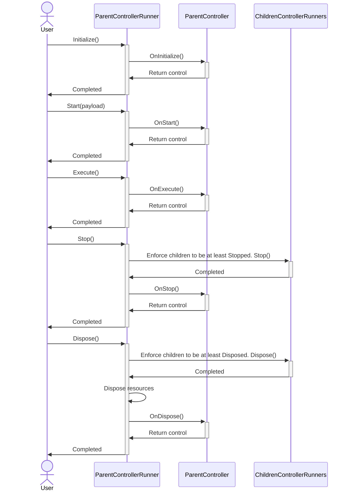

# Controllers Tree

## Modules
- [State Machine](../com.package.controllerstree.addons.extensionpoints/Documentation/README.md)
- [Extension Points](../com.package.controllerstree.addons.extensionpoints/Documentation/README.md)


## Overview
Controllers tree is a HMVP like pattern
Main speciality is a tree structure that is great in managing resources and for working with game state
And you will have maximum benefits when you will use controllers in most part of game where you uses resources

## When to use
Use for meta part, with windows/popups. For core gameplay it suitable only as entry point and managing resources.
Good practice is use a one controller for one window.

## When don't use
If you have no resources in your controller, then maybe you don't need a controller
I.e. in case when you have controller for some calculations, in that case better to use regular interface

## How to use
```csharp
var runner = ControllersTreeBootstrap.Create(new YourEntryPoint());
await runner.Initialize(default);

public class YourEntryPoint : ISimpleController
{
    public async UniTask OnInitialize(IControllerResources resources, CancellationToken token)
    {
        //Preload resources
    }

    public async UniTask OnStart(DummyType payload, IControllerResources resources,
        IControllerChildren controllerChildren,
        CancellationToken token)
    {
        //Show animations
        //Subscribe on buttons
    }

    public async UniTask<DummyType> Execute(IControllerResources resources, IControllerChildren controllerChildren,
        CancellationToken token)
    {
        //Main logic, await clicks
        var yourNextController = controllerChildren.Create<YourNextController>(this, () => new YourNextController());
        await yourNextController.Run(token);
    }

    public async UniTask OnStop(CancellationToken token)
    {
        //Unsubscribe on clicks
        //Hide animations
    }

    public async UniTask OnDispose(CancellationToken token)
    {
        //Dispose unmanaged resources if they were not added in IControllerResources
    }
}
```

## Lifecycle
### Main idea
Main idea is having pair of lifecycle:
- Initalize <-> Dispose
- Start <-> Stop

If your controller completed `Initialize` then it might be safely disposed by `Dispose`. And the same with `Start` and `Stop` pair

```mermaid
sequenceDiagram
    
Create->>OnInitialize:Initialize()
OnInitialize->>OnStart:Start(payload)
OnStart->>OnExecute:Execute()
OnExecute->>OnStop:Stop()
OnStop->>OnDispose:Dispose()
OnStart->>OnStop:Stop()
OnInitialize->>OnDispose:Dispose()
```

### Children
All children forced by parent controllers to have at least the same states during closing

For example, FooController(State.Execute) has child BarController(State.Started). During calling `.Stop()` for FooController, BarController will be stopped as well



## Exception handling
All exception throws to user at the same method.
Exception in children controllers don't infuence on other child controller executions

